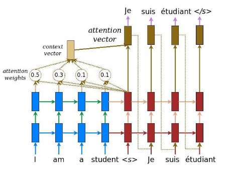
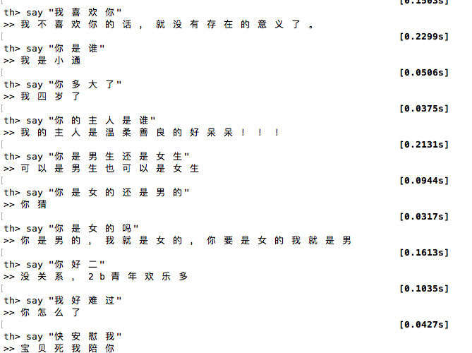

Know a resource that isn't listed below? Feel free to create a new [pull request](https://github.com/fateleak/awesome-chatbot-list/pulls), or open an [issue](https://github.com/fateleak/awesome-chatbot-list/issues/new).Seq2seq/chatbot/聊天机器人相关资源收集列表。

在原来的chatbot-links的基础上，添加了一些更多的中文资源而组建的一个List，主要用于个人收集。感兴趣，一起建设完善的资源列表，方便萌新入门，请发送PR或Issue添加更多资源，各层面不限，欢迎添加自己的作品。

为了方便中文用户中对chatbot/NLP/DeepLearning感兴趣的朋友们互相交流，我建了一个QQ群，欢迎加入讨论：

良好的氛围在于共同的努力，欢迎您加入讨论，畅所欲言！

___

##### [DeepQA](https://github.com/Conchylicultor/DeepQA)
Framework: Tensorflow
Demo result:

    Hi			            	→ Hi.
    What is your name ?			→ Laura.
    What does that mean ?		→ I dunno.
    How old are you ?			→ thirty-five.
    Who is Laura ?				→ My brother.
    Say 'goodbye'				→ Alright.
    Two plus two				→ manny...

##### [tf_seq2seq_chatbot](https://github.com/nicolas-ivanov/tf_seq2seq_chatbot)
Framework: Tensorflow

No answering randomisation is implemented in this code, so the models answers with the same phrase way each time:
未实现回答的是随机化，仅对模型的末尾加入了稀疏层。

    hello baby					→ hello
    how old are you ?			→ twenty .
    i am lonely					→ i am not
    nice						→ you ' re not going to be okay .
    so rude						→ i ' m sorry .
    are you a robot or human?	→ no .
    are you better than siri?	→ yes .

####  [machine translation model](https://github.com/tensorflow/tensorflow/tree/master/tensorflow/models/rnn/translate)

Framework: Tensorflow

Google Official seq2seq implementation, attention included. Originlly for translation, can be used as Q/A;
Google官方的seq2seq实现，采用了注意力机制(Luong et al., 2015)，原本用于语言翻译，也适用于简单Q/A。

**Torch**

##### [Neural-Dialogue-Generation](https://github.com/jiweil/Neural-Dialogue-Generation)
Framework: Torch 6.x
Source code for a bunch of super nice articles by Jiwei Li - one of my favorite researches in the domain of neural conversational systems. Worth checking out.

    tell me ... how long have you had this falling sickness ?   → a few months, I guess .
    so i had the doctors test sammy ’s response to conditioning .   → so he took the pills .
    what are you going to do ?  → i ’m going to get you a new car .
    they fear your power your intellect .   → i ’m not afraid of your power .

##### [neuralconvo](https://github.com/macournoyer/neuralconvo)

Framework: Torch 7

最早的对《A Neural Conversational Model》的实现之一，当时给的Demo效果非常有意思。

    Hello?					→ Hi.
    How are you?			→ I'm fine.
    What's your name?		→ It's hard to describe.
    How so?					→ I'm not sure.
    What color is the sky?	→ It's blue.
    What is your job?		→ It's not that i'm a fucking werewolf!

#####[chatbot-zh-torch7](https://github.com/fateleak/chatbot-zh-torch7)

Framework: Torch 7

从neuralconvo修改而来的，一个中文的chatbot demo。

##### [farizrahman4u/seq2seq](https://github.com/farizrahman4u/seq2seq)
##### [nicolas-ivanov/debug_seq2seq](https://github.com/nicolas-ivanov/debug_seq2seq)
##### [codekansas/keras-language-modeling](https://github.com/codekansas/keras-language-modeling)
Framework: keras

这几个都是seq2seq的实现，但是在Chatbot上面还没有好的结果。

##### [oswaldoludwig/Seq2seq-Chatbot-for-Keras](https://github.com/oswaldoludwig/Seq2seq-Chatbot-for-Keras)
A new generative chatbot whose training converges in few epochs, including a model pre-trained on a small but consistent dataset collected from dialogues of English courses online.

这个采用了生成模型的方式，待补充。

    user: Hello! How are you?
    computer:  i am fine , ok , well , thank you  .    (with probability of 0.540239)
    user: What's your name?
    computer:  janet .     (with probability of 0.319482)
    user:  What do you like to do now?
    computer:  let me think a minute .     (with probability of 0.286760)
    user: I want to chat about computer science.
    computer:  i am glad to hear there .     (with probability of 0.293063)
    user: Are you a real girl or a computer program?
    computer:  i am self employed . i would love to be well .     (with probability of 0.026870)
    user: Why don't you look for a job?
    computer:  i do not know . i am the bank .     (with probability of 0.053494)
    user: So, you don't need a job!
    computer:  no . i have to make a lot of money .     (with probability of 0.001279)

## Corpus
##### [AlJohri/OpenSubtitles](https://github.com/AlJohri/OpenSubtitles)
Get a lot of raw movie subtitles (~1.2Gb)

##### [Cornell Movie-Dialogs Corpus](http://www.cs.cornell.edu/~cristian/Cornell_Movie-Dialogs_Corpus.html)
~ 40Mb after clearing out the technical data.

#####[dgk_lost_conv](https://github.com/fateleak/dgk_lost_conv)
1Gb左右的[中文]语料。大部分为由字幕生成的材料，少量其它对话(如以前的小黄鸡的材料)。
其中results/xiaohuangji50w_fenciA.conv.zip为上面chatbot-zh-torch7的演示的训练材料。

#####[原射手网的打包字幕合集17G](http://afcapp.boringuniverse.com)
现已关闭的射手网有一个所有字幕的合集包，请自行网上搜索下载。

## Papers

* [\[1\] Sequence to Sequence Learning with Neural Networks][1]
* [\[2\] A Neural Conversational Model][2]

[1]: http://papers.nips.cc/paper/5346-sequence-to-sequence-learning-with-neural-networks.pdf
[2]: http://arxiv.org/pdf/1506.05869v1.pdf

## 贡献列表
[fateleak](http://github.com/fateleak)